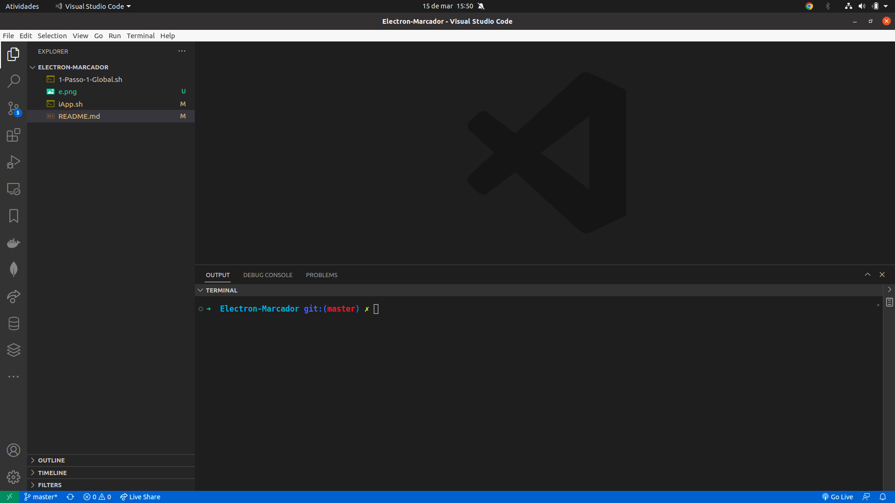
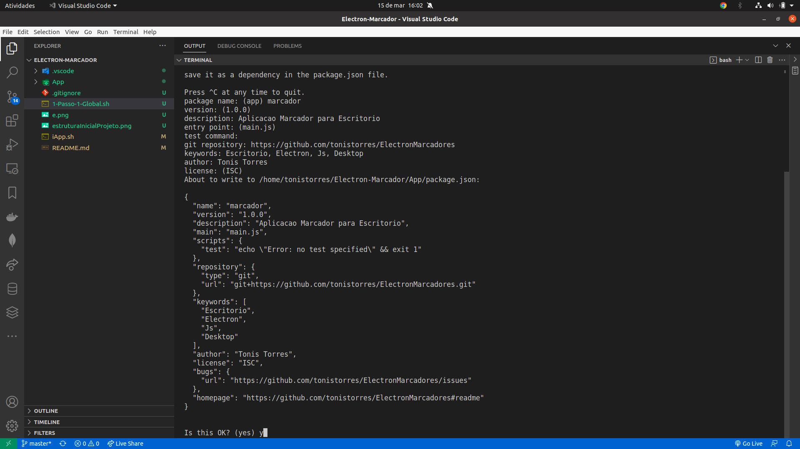
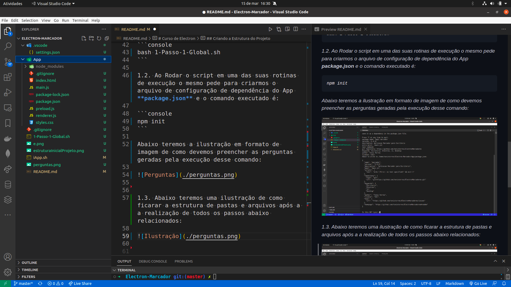
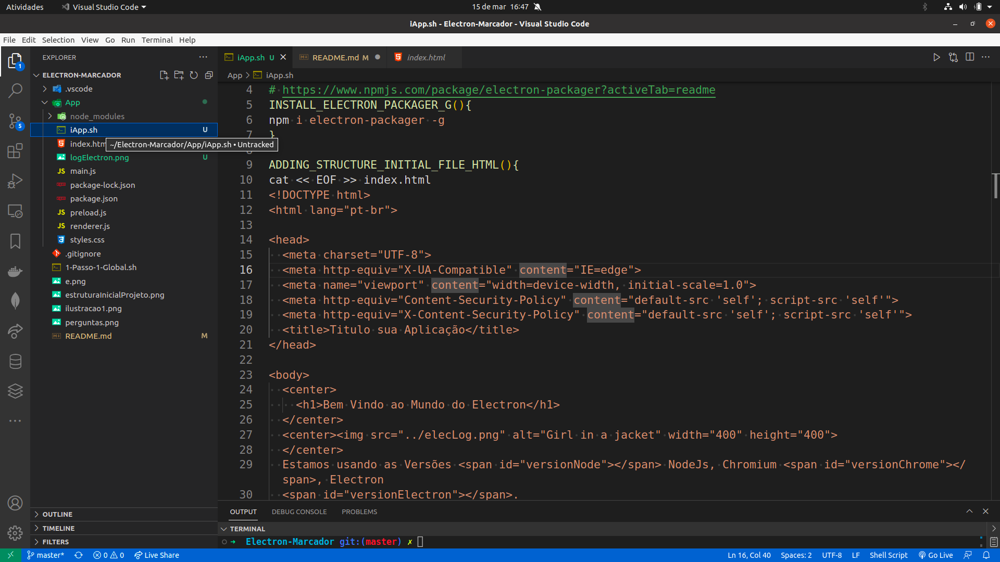

[Link Top de Pesquisa de Markdown](https://www.markdownguide.org/basic-syntax/#headings)
[Link da Documentação do Electron](https://www.electronjs.org/pt/docs/latest/tutorial/quick-start)


# Documentando a Aplicação

<p>
<i>
<h3>
O que é Electron? O Electron é um framework de código aberto para desenvolvimento de aplicações desktop utilizando tecnologias web (HTML, CSS e JS). Originalmente criado por Cheng Zhao, é atualmente mantido pela equipe de desenvolvimento do Github e por toda a comunidade.
</h3>
</i>
</p>

<p>
<i>
<h3>
 Atualmente na versão 4.0, e mantido sob a licença MIT, o Electron permite a criação de aplicações multiplataforma (Windows, macOS e Linux) utilizando uma mesma tecnologia e com interfaces nativas. Por utilizar JavaScript, possui diversos adeptos pelo mundo, já que esta linguagem é amplamente utilizada.
</h3>

## Da Criação do Aplicativo

1. Aplicativos Electron seguem a mesma estrutura geral que outros projetos Node.js. Comece criando uma pasta e inicializando um pacote npm.

- PONTO DE ATENÇÃO: Para esssa aplicação implementei algumas melhorias no script shell passando algumas responsabilidades criacionais para o próprio script resolver.
-  O script Sheel que contem essas melhorias é o **1-Passo-1-Global.sh** que terá a codificação criacional. Segue abaixo a forma de executar o arquivo **1-Passo-1-Global.sh**:

1.1. Vale apenas ressaltar que dentro da pasta root (principal) do projeto, inicialmente terá os seguintes arquivos conforme ilustração abaixo:



```console
Electron-Marcador
      |1-Passo-1-Global.sh
      |e.png
      |estruturaInicialProjeto.png
      |iApp.sh
      |README.md
```

No terminal dentro da pasta root (principal) do projeto, onde se encontram os arquivos já mencionado e ilustrado acima. Execute o Script shell que irá efetuar os procedimentos necessário para criar a estrutura inicial do projeto electron.

Digite o código abaixo e precione ENTER.


```console

bash 1-Passo-1-Global.sh

```

1.2. Na execução do script, em uma das rotinas de execução, o mesmo irá solicitar para que configuremos o arquivo **package.json** responsável pelas configuraões e dependência do App. O comando que o script vai executar de forma automática por meio de uma função shell é o abaixo ilustrado :

```console

npm init

```

PONTO DE ATENÇÃO:O comando interativo **init** solicitará que você defina alguns campos em sua configuração. Existem algumas regras a seguir para os propósitos deste tutorial:

entry point deve ser **main.js**.
**author** e **description** podem ser de qualquer valor, mas são necessários para o pacote do aplicativos.   

Seu arquivo package.json deve ser parecido com isto:

```json
{
  "name": "my-electron-app",
  "version": "1.0.0",
  "description": "Hello World!",
  "main": "main.js",
  "author": "Jane Doe",
  "license": "MIT"
}

```

Abaixo teremos a ilustração em formato de imagem elucidando a forma de preenchimento das perguntas geradas pelo comando criação do arquivo **package.json**:




1.3. Abaixo teremos uma ilustração de como irá ficar a estrutura de pastas e arquivos após a a realização de todos os passos acima relacionados:




1.4. Estrutura inicial pronta agora pegamos o arquivo **iApp.sh** (shell) e copiamos para dentro da pasta App e efetuamos sua execução conforme ilustramos logo abaixo:



```console

bash iApp.sh

```
- Serão executadas funções shell que irá criar arquivos e pastas e instalação de dependências do projeto. 

Dentro da Pasta App no arquivo package.json iremos fazer a seguinte alteração na chave script.

```json
INICIALMENTE A CHAVE SE ENCONTRA DA SEGUINTE FORMA:
"scripts": {
    "test": "echo \"Error: no test specified\" && exit 1"
  },

MODIFICAR PARA:

  "scripts": {
    "start": "electron ."
  },

```

